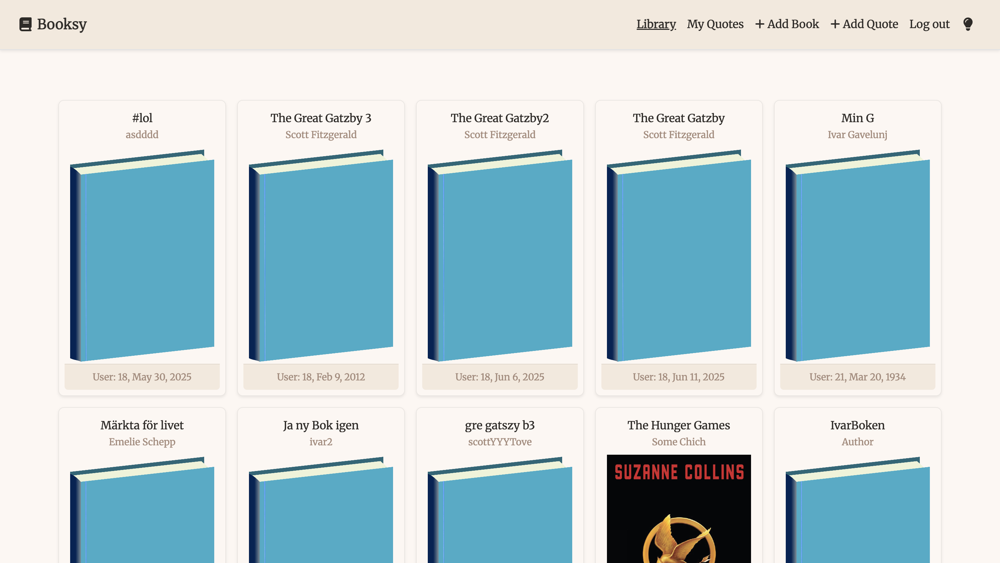
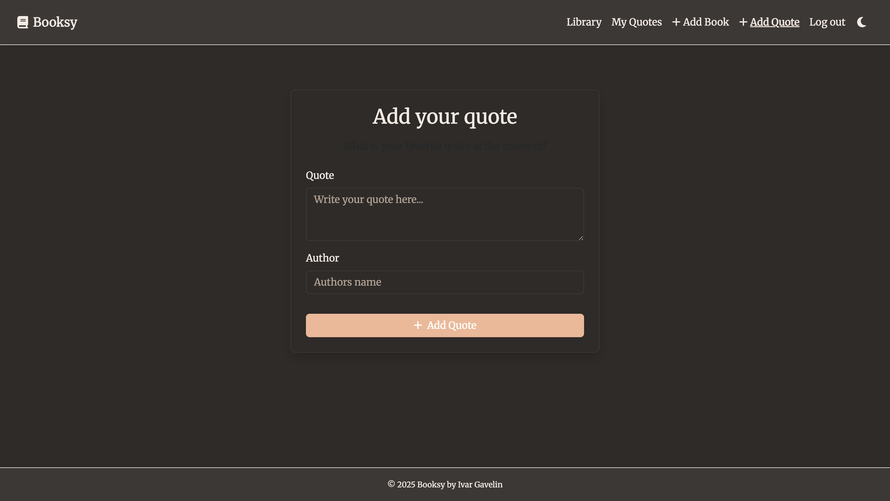

# 📚 Booksy – A Full-Stack Book Tracker App

Booksy is a modern full-stack web application built with **Angular 18** and **.NET 8**, designed for managing and rating books and favorite quotes. The app features JWT authentication, a responsive UI, and full CRUD functionality with SQLite as the backend database.

## 🌐 Live Demo

👉 [Visit Booksy](https://booktrackerbooksy.netlify.app/)  
🔗 Backend hosted on [Render](https://booktracker-n4h6.onrender.com/api/health)

---




## 🚀 Features

- ✅ User registration & JWT login
- 📚 Add, edit and delete books
- 🌟 Rate books (1–5 stars)
- 📝 Save your favorite quotes
- 👥 Admin moderation (delete inappropriate content)
- 🌗 Light/Dark mode toggle
- 🔐 Secure API with authentication tokens
- 🌍 Hosted using Netlify (frontend) and Render (backend)

---



## 🛠 Tech Stack

**Frontend:**
- Angular 18
- TypeScript
- Bootstrap 5
- Font Awesome

**Backend:**
- .NET 8 Web API
- Entity Framework Core
- SQLite database
- JWT Authentication

**Hosting:**
- Frontend: Netlify
- Backend: Render
- Uptime: UptimeRobot monitoring

---

## 🧑‍💻 Getting Started

### Prerequisites

- Node.js & Angular CLI
- .NET 8 SDK
- SQLite CLI (optional, for DB browsing)

### Clone the repo

```bash
git clone https://github.com/Ivargavve/BookTracker.git
cd BookTracker
```

### 🔧 Run Backend (.NET)

```bash
cd backend
dotnet restore
dotnet ef database update
dotnet run
```

Backend will run on: `http://localhost:5051`

### 🖥️ Run Frontend (Angular)

```bash
cd frontend
npm install
ng serve
```

Frontend will run on: `http://localhost:4200`

---

## 📁 Project Structure

```
BookTracker/
├── backend/         # .NET 8 API with SQLite + EF Core
│   └── Controllers/
├── frontend/        # Angular 18 frontend
│   └── src/app/
│       ├── book-form/
│       ├── book-list/
│       ├── quote-page/
│       └── services/
└── README.md
```

---

## ✨ Future Plans

- Google OAuth login
- User profiles & friend list
- Book recommendations
- Achievement system
- Search & filtering functionality

---

## 🧠 Created By

**Ivar Gavelin**  
Civilingenjör Medieteknik, Linköpings Universitet  
[ivargavelin@gmail.com](mailto:ivargavelin@gmail.com)  
[GitHub](https://github.com/Ivargavve)
[Portfolio](https://ivargavelin.com)
